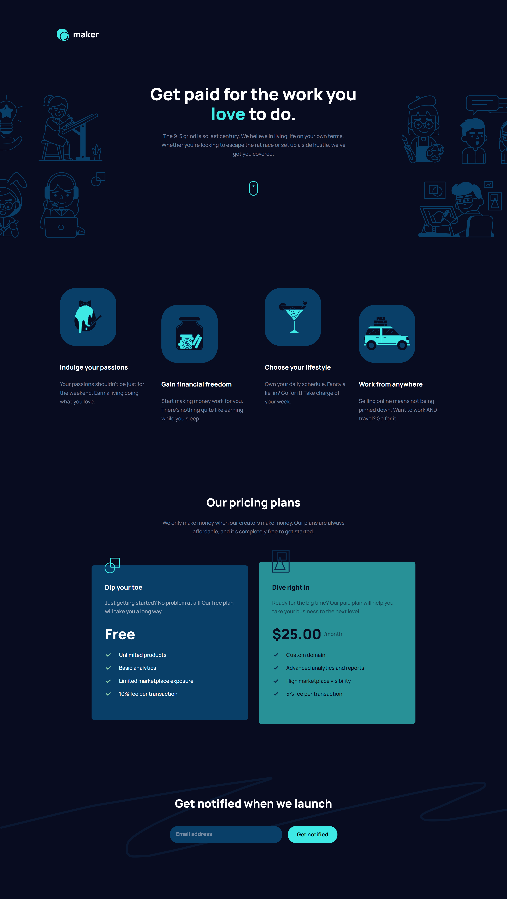

# Frontend Mentor - Maker pre-launch landing page solution

This is a solution to the [Maker pre-launch landing page challenge on Frontend Mentor](https://www.frontendmentor.io/challenges/maker-prelaunch-landing-page-WVZIJtKLd). Frontend Mentor challenges help you improve your coding skills by building realistic projects.

## Table of contents

- [Overview](#overview)
  - [The challenge](#the-challenge)
  - [Screenshot](#screenshot)
  - [Links](#links)
- [My process](#my-process)
  - [Built with](#built-with)
  - [What I learned](#what-i-learned)
  - [Continued development](#continued-development)
  - [Useful resources](#useful-resources)
- [Author](#author)
- [Acknowledgments](#acknowledgments)

**Note: Delete this note and update the table of contents based on what sections you keep.**

## Overview

### The challenge

Users should be able to:

- View the optimal layout depending on their device's screen size
- See hover states for interactive elements
- Receive an error message when the form is submitted if:
  - The `Email address` field is empty should show "Oops! Please add your email"
  - The email is not formatted correctly should show "Oops! That doesn’t look like an email address"

### Screenshot

### Links

- Solution URL: [Frontend Mentor Solution Page](https://www.frontendmentor.io/solutions/responsive-landing-page-with-pricing-and-splithero-look-sJ2NZhopsL)
- Live Site URL: [Hosted on GitHub Pages](https://aleknovkovski.github.io/FEM-maker-pre-launch-landing-page/working/)

## My process

### Built with

- Semantic HTML5 markup
- CSS custom properties
- Flexbox

### What I learned

This is probably the first challenge I've done where I didn't learn anything new in the process, merely because I've done everything before, and solved similar issues and problems before.

### Useful resources

- [Josh Comeau on Rems vs Pixels](https://www.joshwcomeau.com/css/surprising-truth-about-pixels-and-accessibility/#leveraging-css-variables-15) - This helped me because in here Josh shares a really cool trick to make using Rems easy through leveraging CSS variables. It's a lot nicer than using the 62.5% hack

## Author

- Frontend Mentor - [@aleknovkovski](https://www.frontendmentor.io/profile/aleknovkovski)
- Linkedin - [@aleknovkovski](https://www.linkedin.com/in/aleknovkovski/)
